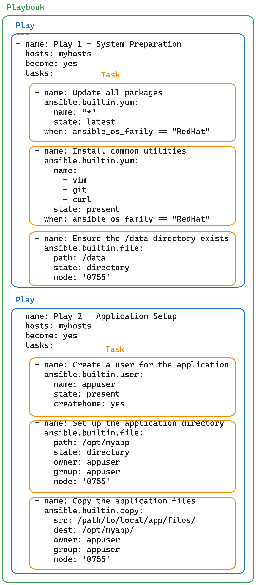

# Tutorial Ansible on local machine

> Note:
> - The following tutorial is performed on MacOS ARM

## Prerequisite

1. Install the folllowing
   1. Python3
   2. Ansible
       1. Install Ansible via pip under Python virtual env.
      ```sh
        $ python3 -m virtualenv .venv
        $ source ./.venv/bin/activate
        (.venv) $ pip3 install ansible
      ```
      2. Verify the Ansible is installed with:
      ```sh
        (.venv) $ ansible --version
        (.venv) $ ansible-playbook --version
      ```

   3. sshpass
      ```sh
        $ brew install sshpass
      ```

## Building an inventory

Inventories contains managed nodes/hosts/addresses in a files that provide Ansible with **system information**, **connection credentials**, and **network locations**.

The inventory file could be either **.ini** or **.yaml** format. Let's see both representation of both format.

[Reference for formating.](https://docs.ansible.com/ansible/latest/getting_started/get_started_inventory.html#inventories-in-ini-or-yaml-format)

```yaml
# inventory.YAML
myhosts:
  hosts:
    my_host_01:
      ansible_host: 192.0.2.50
    my_host_02:
      ansible_host: 192.0.2.51
    my_host_03:
      ansible_host: 192.0.2.52
```

```ini
; inventory.INI
[myhosts]
192.0.2.50
192.0.2.51
192.0.2.52
```

### 1. Let's create a small `inventory.yaml` file and fill a host address.

I already have a DigitalOcean Droplet server available, I will use the public IP for the below host.

If the server require password authentication, more config need to provide

```yaml
myhosts:
  hosts:
    my_host_01:
      ansible_host: 188.X.X.X
  vars:
    ansible_user: my_server_user
    ansible_ssh_pass: my_server_pAssWoDr
```

```ini
[myhosts]
host1 ansible_host=188.X.X.X

[myhosts:vars]
ansible_user=root
ansible_ssh_pass=your_passWoDr
```

Verify the inventory.

```sh
ansible-inventory -i 01_ansible_test/inventory.yaml --list
```

### 2. Ping the `myhosts` group in the inventory

```sh
ansible all -m ping -i 01_ansible_test/inventory.yaml
```

The result should show Pong.

This is just built-in module.

```txt
my_host_01 | SUCCESS => {
    "ansible_facts": {
        "discovered_interpreter_python": "/usr/bin/python3.10"
    },
    "changed": false,
    "ping": "pong"
}
```

## Creating a Playbook

Playbooks are automation blueprints, in YAML format, that Ansible uses to deploy and configure managed nodes.

Important terminologies

1. Playbook: ขั้นตอน Play ทั้งหมดที่เรียงลำดับที่ Ansible จะต้องดำเนินการตั้งแต่เริ่มต้นจนถึงสุดท้าย ด้านบนจนถึงด้านล่าง
2. Play: ชุดที่รวม Task ทั้งหมดเป็นลำดับขั้นตอนตั้งแต่เริ่มต้นจนจบ
3. Task: รายละเอียดชุดคำสั่ง (module) ที่บ่งบอกให้ Ansible ทำงาน ๆ หนึ่งใน managed-node
4. Module: เป็นชุดคำสั่ง จริง ๆ หรือไฟล์สำหรับ execute ที่ Ansible กระทำใน managed-node

The **Playbook** is also a file, which is strictly be a **.YAML** format.

Here is the components of the Playbook file according to the terminologies.



The following is an example of relatively-complexed `playbook.yaml` file.

```yaml
---
- name: Play 1 - System Preparation
  hosts: myhosts
  become: yes
  tasks:
    - name: Update all packages
      ansible.builtin.yum:
        name: "*"
        state: latest
      when: ansible_os_family == "RedHat"

    - name: Install common utilities
      ansible.builtin.yum:
        name:
          - vim
          - git
          - curl
        state: present
      when: ansible_os_family == "RedHat"

    - name: Ensure the /data directory exists
      ansible.builtin.file:
        path: /data
        state: directory
        mode: '0755'

- name: Play 2 - Application Setup
  hosts: myhosts
  become: yes
  tasks:
    - name: Create a user for the application
      ansible.builtin.user:
        name: appuser
        state: present
        createhome: yes

    - name: Set up the application directory
      ansible.builtin.file:
        path: /opt/myapp
        state: directory
        owner: appuser
        group: appuser
        mode: '0755'

    - name: Copy the application files
      ansible.builtin.copy:
        src: /path/to/local/app/files/
        dest: /opt/myapp/
        owner: appuser
        group: appuser
        mode: '0755'
```

### 1. Try creating a simple Playbook

The following is a Playbook from the previous `inventory.yaml`.

```yaml
- name: My first play
  hosts: myhosts
  tasks:
   - name: Ping my hosts
     ansible.builtin.ping:

   - name: Print message
     ansible.builtin.debug:
      msg: Hello world
```

Then, we should run the following command to execute the Playbook. But just use the `run-ansible.sh` script and enter the Server username and password.

```sh
ansible-playbook -i 01_ansible_test/inventory.yaml 01_ansible_test/playbook.yaml
```